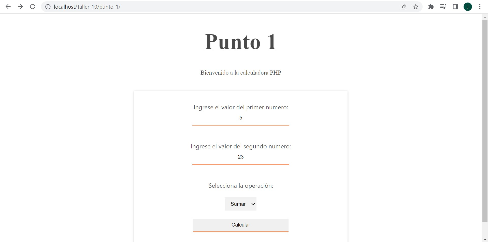
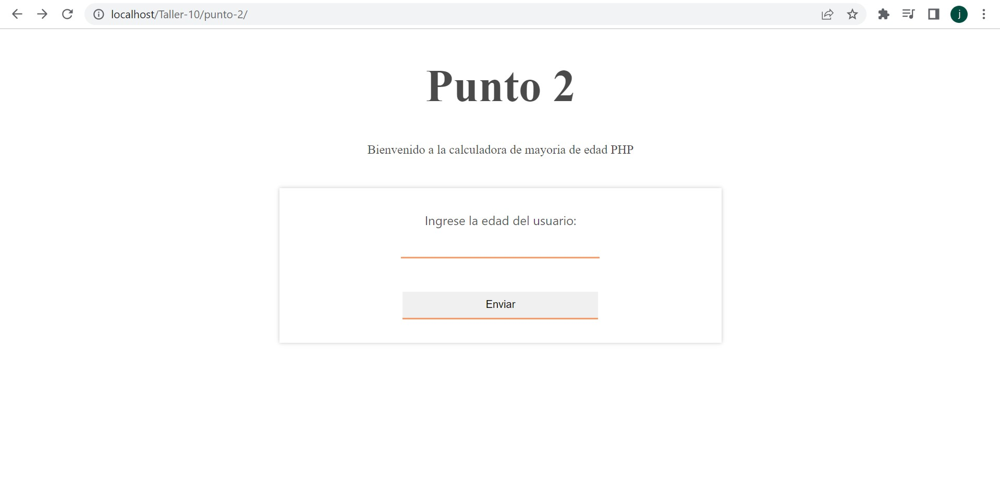
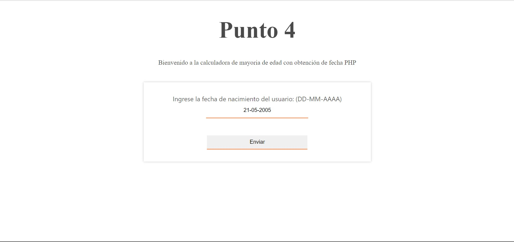
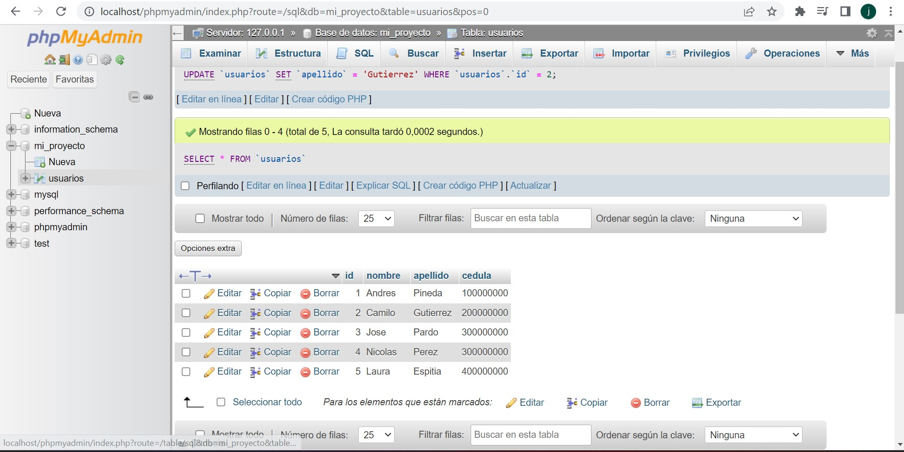
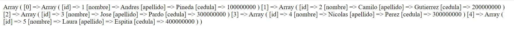
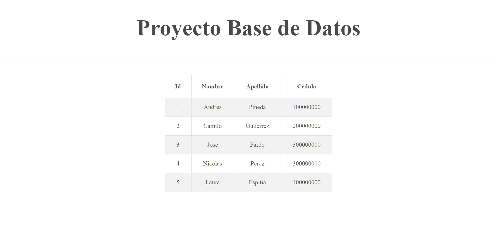

<h1>Taller Back end: Juan Sebastian Mosquera</h1>

<h2>Información</h2>

Curso: Full Stack Intermedio 

Profesor: Andrés Pineda 

<h2>Punto 1</h2>

<h2>Punto 2</h2>

<h2>Punto 3</h2>

<h2>Punto 4</h2>

<h2>Punto 5-6-7</h2>
<h3>5 - Base de datos</h3>

<h3>6 - Conexión</h3>

<h3>7 - Muestra de datos en pantalla</h3>

