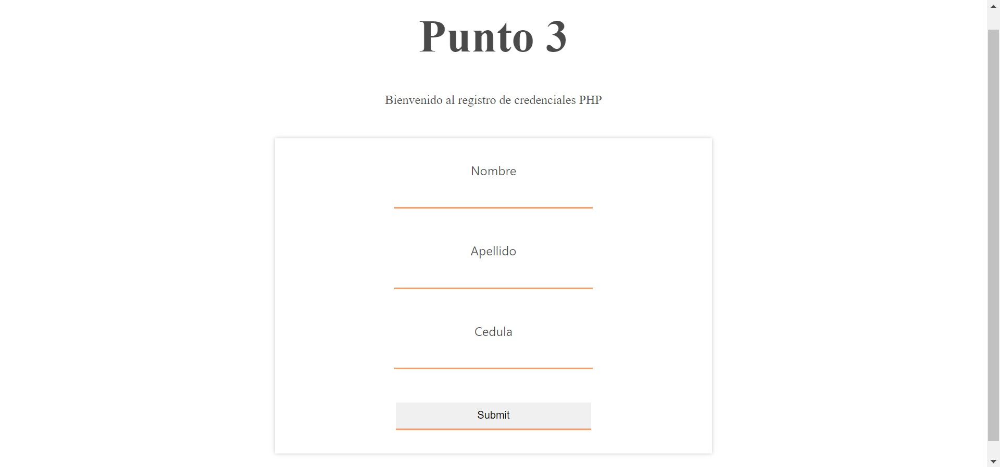

<h1>Taller 10: Juan Sebastian Mosquera</h1>

<h2>Información</h2>

Curso: Full Stack Básico - Grupo 1 

Profesor: Cristian Patiño

<h2>Punto 1</h2>

<h2>Punto 2</h2>

<h2>Punto 3</h2>

<h2>Punto 4</h2>

<h2>Punto 5-6-7</h2>
<h3>5 - Base de datos</h3>
